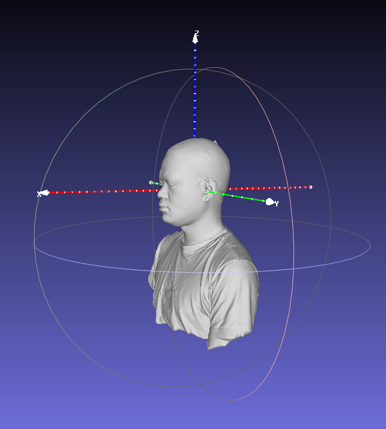
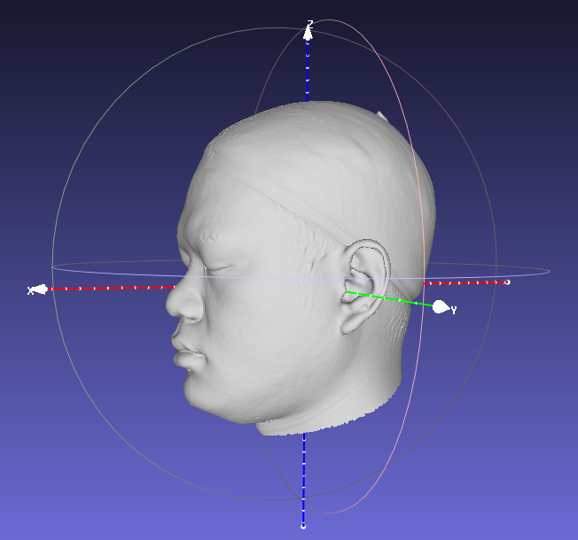
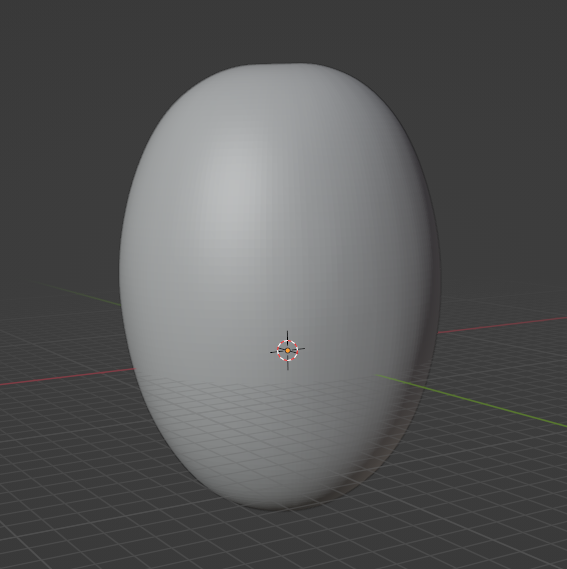
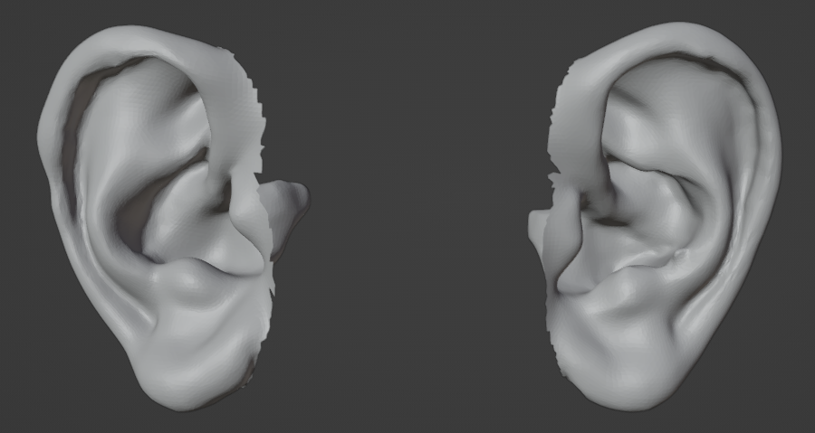
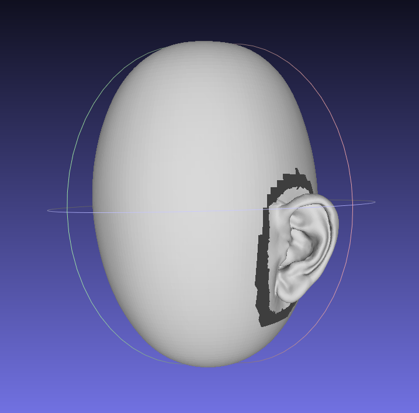
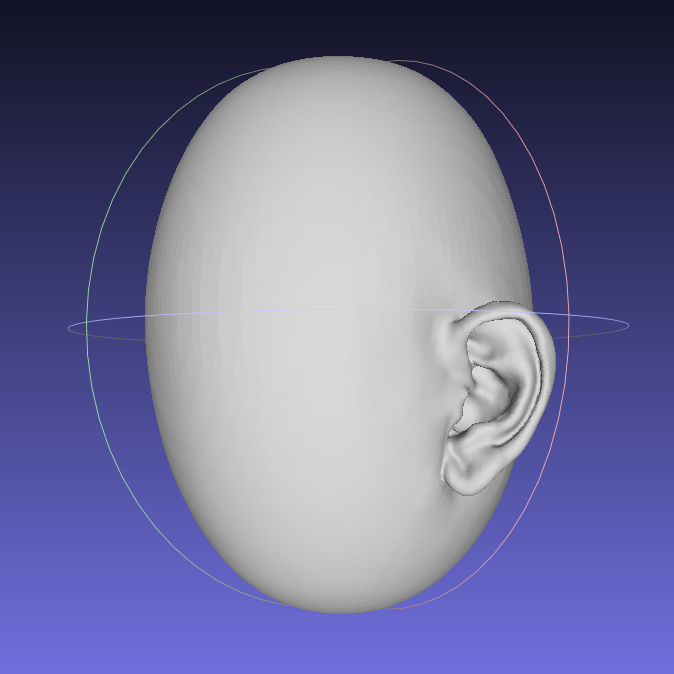
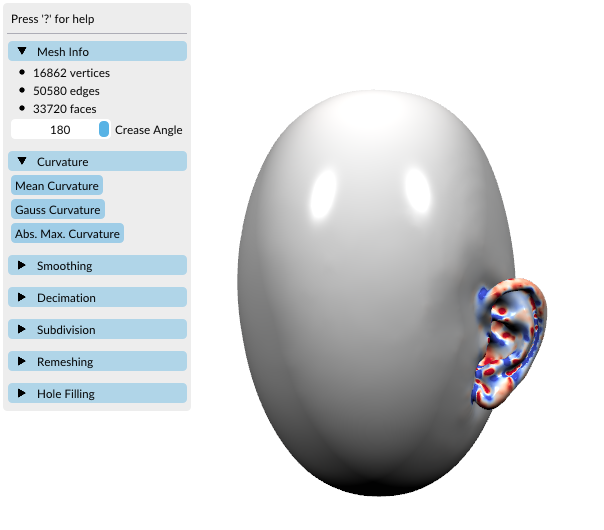
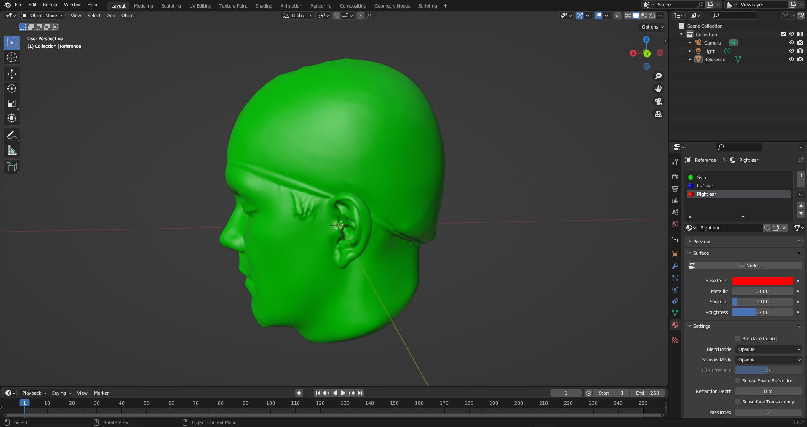
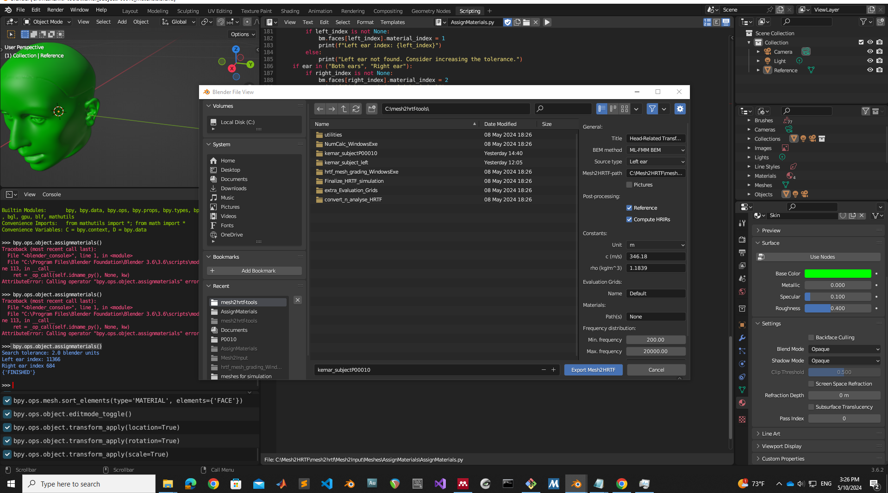

# EXPERIMENT OVERVIEW 
This experiment involved the simulation of Head-Related Transfer Functions (HRTF) using three different configurations of human subjects' 3D ear models:

1- Original Mesh: The subject's full head and ear mesh.

2- Kemar Mesh: The subject's ears attached to a detailed Kemar dummy head.

3- Potato Mesh: The subject's ears attached to a simplified spherical surface, referred to as the "potato".

The goal of the experiment was to evaluate the effects of different head geometries details on the accuracy of simulated HRTFs. By comparing these three cases, we aimed to better understand how details like head shape and ear placement affected spatial audio performance, especially in the context of applications like virtual reality and 3D audio simulations.

This document is not an official tutorial from the creators of mesh2HRTF. Instead, it is a guide where I share the steps I followed during my personal experience working with this incredible tool. Along with the steps, I also highlighted errors I encountered and tips on how to avoid them. All simulations in this experiment were performed following the recommendations of the mesh2HRTF tutorials.

While the steps for all three cases are similar, this document focused solely on the Potato Mesh workflow as an example. The same methodology could be adapted for the Original Mesh and Kemar Mesh cases

# EXPERIMENT STEPS 

## PREPARING THE MESH:

1 - Loading the original subject mesh in Blender.

2 - Running Alignment Script:
This script aligns the mesh based on four key points: both ears, the nose, and the top of the head. These points are used to align the head and torso along the interaural axis, with the nose pointing in the positive direction of the X-axis and the top of the head will allign with the positive Z-axis direction. The alignment step is crucial for accurate HRTF simulation later in the process.

 

   
 

3 - Cutting the head and shoulders of the original subject mesh in MeshLab.

 

   
 

 4 - Saving the Aligned Subject Mesh:

> After cutting the head and shoulders, I saved the resulting model as subjectX_watertight_noTorso_aligned_no_closed.stl. This file is used in subsequent steps for ear extraction and further processing.

## CREATING THE "POTATO" MESH:

The Potato Mesh was designed as a simplified representation of a human head, without detailed anatomical features.

1 - Using a Basic Geometric Shape:

- The Potato Mesh was created using a basic geometric shape—a sphere.

- In Blender, I generated a sphere primitive with a sufficient number of vertices to ensure smoothness. The idea was to approximate a head-like shape while maintaining minimal complexity.

2 - Smoothing the Shape: 

- To make the sphere resemble a more natural head-like shape, I applied slight deformations using Blender's sculpting tools.

- The sculpting process included:

  - Smoothing the surface to avoid sharp edges.

  - Slightly elongating the shape to mimic the general proportions of a human head (elongated along the Z-axis).

- This step ensured that while the mesh remained simple, it still approximated the proportions of a human head without including any specific details like facial features or contours.

3 - Maintaining Symmetry and Alignment:

- It was essential to maintain symmetry during the creation of the Potato Mesh, as the simplified head model needed to reflect the bilateral symmetry of an actual human head.

- I used Blender’s symmetry tools to ensure the mesh remained evenly shaped on both sides of the interaural axis (Y-axis).

- I aligned the potato mesh using the alignment script.

4 - Finalizing the Mesh:
Once the sculpting process was complete, I applied final modifications to ensure that the mesh was watertight and free from unnecessary complexity.
I also ensured the voxel size of the mesh was consistent with the scale required for HRTF simulation.

5 - Exporting the Potato Mesh:

The final version of the Potato Mesh was exported as potato.stl. The result is shown in the image below 

 

   
 

 ## "POTATO MESH" PREPARATION IN BLENDER 

- Loading the subject's watertight aligned mesh (subjectX_watertight_noTorso_aligned_no_closed.stl) into Blender.

- Loading the potato mesh (potato.stl ) into Blender. 

- Hiding the potato mesh temporarily.

- Cutting both ears from the subject's mesh, creating separate "Left ear" and "Right ear" objects.

 

   
 

- Deleting the remaining parts of the subject's mesh (keeping only the ears).

- Saving these separate ear meshes for later steps.

- Unhiding the potato mesh and aligning it with the subject's ear meshes.

- Cutting ear-shaped holes in the potato mesh, leaving a small gap between the ear cutouts and the potato surface.

- Carefully placing the subject’s ears in the cutout regions on the potato model.

   
 

- Saving the combined mesh for further processing.

## SURFACE RECONSTRUCTION IN MESHLAB 

- Importing the combined mesh (Potato + Subject Ears) into Meshlab.

- Apply Surface Reconstruction : Screened Poisson, this tool from Meshlab allow to smooth and finalize the geometry. 

  - Parameters used:
     - Reconstruction Depth : 12 
     - Minimun number of Samples : 1.5 (default)
     - Interpolation weight : 4 (default)
     - Select Pre-Clean

- This process closes any gaps or holes around the ears, ensuring a watertight model.

   

## SCALING THE MESH IN BLENDER 

- Load the merged model into Blender and apply the final adjustments, such as using Sculpt Mode to smooth the final mesh. 

- Scale the model. SONICOM 3D meshes are not scaled, so before performing any calculations, the mesh needs to be scaled to avoid future issues with NumCalc. Normally, the interaural distance of a non-pathological head is between 100 and 180 mm. To scale the model, apply a scale factor of 0.001 (in this particular case) to every axis of the original mesh.

- Use the Remesh tool to obtain a regular surface for the mesh. This step will increase the number of polygons and the file size, but it is almost mandatory for mesh grading with hrtf_mesh_grading_WindowsExe, as the process might fail otherwise. Sculpt Mode > Remesh . Take a sample of the ear's polygon size, use that value to set the voxel size. Select Fix Poles and Preserve Volume.

## RUNNING mesh2HRTF and NumCalc

- Create a conda environment to avoid futures incompatibilities: conda create --name myenv python=3.9.0

- Use Python version 3.9.0 , I've tried with version 3.7.0 and 3.8.0 adn it doesn't work, so, avoid this versions. 

- Install psutil package: pip install psutil

- Clone [mesh2HRTF repository](https://github.com/Any2HRTF/Mesh2HRTF): git clone https://github.com/Any2HRTF/Mesh2HRTF

- Install mesh2HRTF package where mesh2HRTF. Open a new terminal, go to Mesh2HRTF folder directory, activate your conda environment and type : pip install -e .

   

- Download [mesh2hrtf-tools](https://sourceforge.net/p/mesh2hrtf-tools/code/ci/master/tree/) [take a snapshot]

> **Recommendation** : clone mesh2HRTF repo and copy the mesh2hrtf-tools folder directly in the root of the C: drive to prevent potential errors or unexpected behavior during execution.

- Use hrtf_mesh_grading_WindowsExe to prepare the mesh, it must satisfy a list of  checkpoints [here](https://github.com/Any2HRTF/Mesh2HRTF/wiki/Basic_3D_optimization_and_ReMeshing)

  - Copy the final "Potato" mesh version in C:\mesh2hrtf-tools\hrtf_mesh_grading_WindowsExe folder.

  - Rename the "Potato" .stl extension file to 3Dmesh_orig.stl
 
  - Run - run_hrtf_mesh_grading.bat file.
    > This .bat file will create two differents ply files 3Dmesh_graded_left.ply and 3Dmesh_graded_right.ply, each mesh will have around 60000 polygons (just what we want). Images below show the 3Dmesh_graded_left.ply result . 

  

   
   

- Use the sculpt tool in Blender to smooth the area where the ear was removed.

- Loading the 3Dmesh_graded_left.ply and 3Dmesh_graded_right.ply into Blender, one at time.

- Loading the script AssignMaterials located in C:\Mesh2HRTF\mesh2hrtf\Mesh2Input\Meshes\AssignMaterials into Blender.

  - Renaming the mesh to "Reference."
 
  - Selecting the model and running bpy.ops.object.assignmaterials() in the Blender Python interactive console.

  - This command will create three materials: "Skin," "Left ear," and "Right ear," and assign each material where it corresponds:

    - Skin will be assigned to every face/polygon of the mesh.

    - Right and Left ear materials will be assigned to the ear canal entrance.

    > Important: Ensure the model is properly aligned before running this step.
 
    - Delete the material where there is no ear, for example , if we are working with 3Dmesh_graded_right.ply we need to delete the material "Left ear" the blue one. 

    - Adjust the material position where the ear is, if necessary, to ensure proper placement.

   

   
- Repeating the same process for both meshes (3Dmesh_graded_left.ply and 3Dmesh_graded_right.ply).
 
- Exporting the project.

> After assigning the materials , the next step is exporting the project with the correct parameters for the HRTF simulation. Below are the best parameters to use when exporting the project in Blender, along with explanations for each setting.

- Parameters to export the project in Blender:

  - **BEM Method:** ML-FMM BEM
  > This is the boundary element method used for the simulation. In this case, ML-FMM BEM (Multi-Level Fast Multipole Method) is recommended for accurate and efficient HRTF computation.

  - **Source Type:** Left Ear or Right Ear
  >Choose either the Left ear or Right ear, depending on which side you are working on at the moment.

  - **Mesh2HRTF Path:** C:\Mesh2HRTF\mesh2hrtf
  > Set the path where the Mesh2HRTF tools are located. This is typically set to the root folder where Mesh2HRTF was cloned.

  - **Post-processing settings:**

    - **Reference**
    > Enable to set a reference point for the simulation.

    - **Compute HRIRs**
    > Select this option to compute the Head-Related Impulse Responses (HRIRs) during the simulation.

   - **Constants:**

     - Unit: m (meters)
     > Make sure to select meters as the unit. If millimeters (mm) are selected, it may cause errors when running manage_numcalc_script.py due to issues estimating RAM.

     - c (m/s): 346.18 (default)
     > This is the speed of sound in air, set to 346.18 meters per second.

     - rho(kg/m^3): 1.1839 (default)
     > This is the density of air, set to 1.1839 kilograms per cubic meter.

     - **Evaluation Grids:**

       - Name: default
       > This is the folder name containing the evaluation grids, which define the positions where the HRTF will be simulated. These grids are used to specify the spatial sampling points for the simulation. By default it takes the ARI set up.
       > Evaluation grids folder path: C:\Mesh2HRTF\mesh2hrtf\Mesh2Input\EvaluationGrids\Data.

     - **Materials:**
      
      - None (default)
      > No special material settings are required unless you are working with specific material properties.

     - **Frequency Distribution:**

       - Min. frequency: 0 Hz

       - Max. frequency: 22050 Hz

       - Step size: 150
       > This step size allows for a sampling rate of 44.1 kHz and 48 kHz.

   

- Running the manage_numcalc_script.py:

  - Pass to it the paths for both the project folder and the NumCalc_WindowsExe.
  
  - The path to NumCalc_WindowsExe is: C:\mesh2hrtf-tools\NumCalc_WindowsExe.

  > **Important**: Since there are two separate projects , one for the left ear and one for the right ear, you must run the script twice, once for each ear.

- Running finalize_hrtf_simualtion.py script.

> Once NumCalc has finished, move both project folders right and left to "Finalize_HRTF_simulation" folder ,it will merge both folders and build the SOFA files, this steps looks for the available
> sample rates to calculate the HRIR of SOFA files.

## FINALIZATION:
> After running manage_numcalc_script.py for both the left and right ear projects and completing the merging process with finalize_hrtf_simulation.py, a folder will be generated containing the simulation results.

- **Checking the Folder:**

  - Inside the folder, you will find the merged SOFA files, which contain the final HRTF and HRIR data.

  - Ensure that both the left and right ear data have been correctly merged into the final output files.

- **Verifying the Data:**

   - Open the SOFA files using a compatible SOFA viewer (or analysis tool) to verify the data.
   
   - Check that the spatial resolution and frequency range match the parameters you set during the simulation.
   
   - Confirm that no errors occurred during the merging process and that the files are complete.

 

