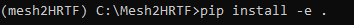
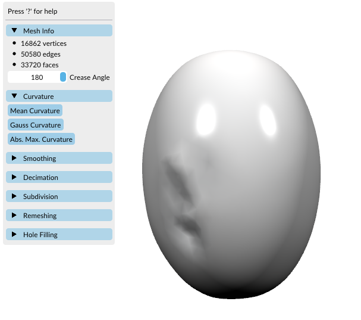

# EXPERIMENT OVERVIEW 
This experiment involved the simulation of Head-Related Transfer Functions (HRTF) using three different configurations of 3D models of human subjects' head:

1- Original Mesh: The subject's full head and ear mesh.

2- Kemar Mesh: The subject's ears attached to a detailed Kemar dummy head.

3- Potato Mesh: The subject's ears attached to a simplified spherical surface mimicking a human head with no morphological details, referred to as the "potato".

The goal of the experiment was to evaluate the effects of different head geometries details on the accuracy of simulated HRTFs. By comparing these three cases, we aimed to better understand how details like head shape and ear placement affected spatial audio performance, especially in the context of applications like virtual reality and numerical simulations. Additionally, we wanted to analyze how the different head meshes influence the numerical HRTF simulation itself, with special attention to the impact of outer ear morphology at higher frequencies. These high frequency cues, which are strongly shaped by the pinna, play a major role in localization accuracy in specific spatial planes such as elevation and the median plane. Incorporating this perspective allowed us to investigate how both global head geometry and fine ear detail contribute to the overall HRTF behavior. 

This document is not an official tutorial. Instead, it is a guide where we shared the steps we followed working with this incredible tool. Along with the steps, we also highlighted errors we encountered and tips on how to avoid them. All simulations in this experiment were performed following the recommendations of the mesh2HRTF tutorials.

While the steps for all three cases are similar, this document focused solely on the Potato Mesh workflow as an example. The same methodology could be adapted for the Original Mesh and Kemar Mesh cases

# EXPERIMENT STEPS 

## PREPARE THE MESH:

1 - Load the original subject mesh in Blender.

2 - Run Alignment Script:  
This script aligns the mesh based on four key points: both ears, the nose, and the top of the head. These points are used to align the head and torso along the interaural axis, with the nose pointing in the positive direction of the X-axis and the top of the head will allign with the positive Z-axis direction. The alignment step is crucial for accurate HRTF simulation later in the process (see Figure 1).

<em>Figure 1 – Aligned original subject mesh.</em>

3 - Cut the head and shoulders of the original subject mesh in MeshLab (see Figure 2).

<em>Figure 2 – Subject mesh after removing torso.</em>

4 - Save the Aligned Subject Mesh:

> After cutting the head and shoulders, we saved the resulting model as subjectX_watertight_noTorso_aligned_no_closed.stl. This file is used in subsequent steps for ear extraction and further processing.

## CREATE THE "POTATO" MESH:

The Potato Mesh was designed as a simplified representation of a human head, without detailed anatomical features, The dimensions were chosen based on typical human head measurements, taking into account that the width usually falls between 140 and 160 mm and the height generally ranges from 210 to 250 mm.

1 - Use a Basic Geometric Shape:

- The Potato Mesh was created using a basic geometric shape, a sphere.

- In Blender, we generated a primitive sphere with a sufficient number of vertices to ensure smoothness. The idea was to approximate a head-like shape while maintaining minimal complexity.

2 - Smooth the Shape: 

- To make the sphere resemble a more natural head-like shape, we applied slight deformations using Blender's sculpting tools.

- The sculpt process included:

  - Smooth the surface to avoid sharp edges.

  - Slightly elongate the shape to mimic the general proportions of a human head (elongated along the Z-axis).

- This step ensured that while the mesh remained simple, it still approximated the proportions of a human head without including any specific details like facial features or contours.

3 - Maintain Symmetry and Alignment:

- It was essential to maintain symmetry during the creation of the Potato Mesh, as the simplified head model needed to reflect the bilateral symmetry of an actual human head.

- We used Blender’s symmetry tools to ensure the mesh remained evenly shaped on both sides of the interaural axis (Y-axis).

- We aligned the potato mesh using the alignment script.

4 - Finalize the Mesh:  
Once the sculpting process was complete, we applied the final modifications to ensure that the mesh was watertight and free from unnecessary complexity. We also ensured the voxel size of the mesh was consistent with the scale required for HRTF simulation.

5 - Export the Potato Mesh (see Figure 3):

<em>Figure 3 – Final Potato Mesh.</em>

## PREPARE "POTATO MESH" IN BLENDER 

- Load the subject's watertight aligned mesh (subjectX_watertight_noTorso_aligned_no_closed.stl) into Blender.

- Load the potato mesh (potato.stl ) into Blender. 

- Hide the potato mesh temporarily.

- Cut both ears from the subject's mesh, creating separate "Left ear" and "Right ear" objects (see Figure 4).

<em>Figure 4 – Extracted left and right ear meshes.</em>

- Delete the remaining parts of the subject's mesh (keeping only the ears).

- Save these separate ear meshes for later steps.

- Unhide the potato mesh and aligning it with the subject's ear meshes.

- Cut ear-shaped holes in the potato mesh, leaving a small gap between the ear cutouts and the potato surface.

- Carefully place the subject’s ears in the cutout regions on the potato model (see Figure 5).

<em>Figure 5 – Potato mesh with ear placement before merging.</em>

- Save the combined mesh for further processing.

## SURFACE RECONSTRUCTION IN MESHLAB

- Load the mesh (Potato + Subject Ears) into MeshLab, apply the tool “Surface Reconstruction: Screened Poisson” (Filters > Remeshing, Simplification and Reconstruction > Surface Reconstruction: Screened Poisson). 
 
  - Parameters used:
     - Reconstruction Depth : 12 
     - Minimun number of Samples : 1.5 (default)
     - Interpolation weight : 4 (default)
     - Select Pre-Clean

- This step will automatically close holes, fill gaps and fix non-manifold geometry, producing a clean and continuous mesh. (see Figure 6).

<em>Figure 6 – Cleaned and reconstructed Potato+Ears mesh.</em>

## SCALE THE MESH IN BLENDER 

- Load the merged model into Blender and apply the final adjustments, such as using Sculpt Mode to smooth the final mesh. 

- Scale the model. SONICOM 3D meshes are not scaled, so before performing any calculations, the mesh needs to be scaled to avoid future issues with NumCalc. Normally, the interaural distance of a non-pathological head is between 140 and 160 mm. To scale the model, apply a scale factor of 0.001 (in this particular case) to every axis of the original mesh.

## REMESH TOOL IN BLENDER 

-	Use the Remesh tool in Blender to get a regular surface. Sculpt Mode > Remesh. Take a sample of the ear's polygon size, use that value to set the voxel size. Select Fix Poles and Preserve Volume. This step will increase the number of polygons and the file size, but it’s almost mandatory for mesh grading with hrtf_mesh_grading_WindowsExe tool, as the process might fail otherwise. This step also allows us to obtain a watertight model, ensuring the surface is completely closed and suitable for further processing. To verify this in MeshLab, apply the filter “Compute Topological Measures” (Filters → Quality Measures and Computations → Compute Topological Measures) and confirm that the values “Boundary Edges = 0” and “Holes = 0” are reported, indicating that the mesh is watertight. 

## RUN mesh2HRTF and NumCalc

- Create a conda environment to avoid futures incompatibilities: conda create --name myenv python=3.9.0

- Use Python version 3.9.0 or higher, W've tried with old versions but it doesn't work for us

- Install psutil package: pip install psutil

- Clone [mesh2HRTF repository](https://github.com/Any2HRTF/Mesh2HRTF): git clone https://github.com/Any2HRTF/Mesh2HRTF

- Download mesh2hrtf-tools. Go to https://sourceforge.net/p/mesh2hrtf-tools/code/ci/master/tree/ and click in "Download Snapshot"

- Copy Mesh2HRTF and mesh2hrtf-tools folders preferably to main system disk C:\  

- Install the mesh2HRTF package, open a new terminal, navigate to the Mesh2HRTF folder, activate your conda environment, and run: pip install -e .

<em>Figure 7 – mesh2HRTF installation.</em>

  - This step will also install matplotlib , numpy , sofar and pyfar packages, among others. IMPORTANT :  To avoid incompatibilites, we must use the next version of these packages : matplotlib=3.7.0 , pyfar=0.5.4 and sofar=1.1.3

- Use hrtf_mesh_grading_WindowsExe tool to prepare the mesh. To follow this step properly: first go to the folder C:\mesh2hrtf-tools\hrtf_mesh_grading_WindowsExe and copy your final Potato mesh into this directory. Rename the file to 3Dmesh_orig.stl. Then locate the script run_hrtf_mesh_grading.bat and run it by double-clicking. This batch file automatically executes all internal tools (such as mesh_cleaning.exe, mesh_grading_left.exe, mesh_grading_right.exe, and boundary_check.exe), performs the full grading workflow, and splits the mesh into left and right versions. After the process finishes, two new files will be generated: 3Dmesh_graded_left.ply and 3Dmesh_graded_right.ply, each containing approximately 60,000 polygons. These correspond to the results shown in Figures 8 and 9.

<em>Figure 8 – Graded mesh (view 1).  
Figure 9 – Graded mesh (view 2).</em>

- Use the sculpt tool in Blender to smooth the area where the ear was removed.

- Load the 3Dmesh_graded_left.ply and 3Dmesh_graded_right.ply into Blender, one at time.

- Load the script AssignMaterials into Blender and apply it (see Figure 10). To do this, open Blender and load your graded mesh, then switch to the Scripting workspace and use the text editor’s “Open” button to load the file located at C:\Mesh2HRTF\mesh2hrtf\Mesh2Input\Meshes\AssignMaterials\AssignMaterials.py. Alternatively, you can open the .py file in any text editor outside Blender, copy its code, and paste it directly into Blender’s scripting editor if that is easier. Run the script using the “Run Script” button in the text editor. Blender will automatically create the three materials—Skin, Left ear, and Right ear—and assign them to the corresponding regions of the mesh. At this point, remove the material that does not apply to the current mesh (for example, delete the Left ear material when working on the right-ear mesh) and adjust the ear-canal material placement if necessary to ensure accurate assignment.

<em>Figure 10 – AssignMaterials script applied in Blender.</em>

- Repeat the same process for both meshes.

- Export the project for HRTF simulation (see Figure 11). To do this, open Blender’s Mesh2HRTF export panel and first make sure your mesh is selected, then choose the correct BEM method (ML-FMM BEM) and set the Source Type to either Left Ear or Right Ear depending on the mesh you are exporting. After that, specify the Mesh2HRTF path by pointing Blender to the folder C:\Mesh2HRTF\mesh2hrtf, enable the “Reference” option, and activate “Compute HRIRs” in the post-processing section. Next, verify that the constants are set correctly by selecting meters as the unit and keeping the default values for air density and speed of sound. Then select the evaluation grid by choosing “default,” which corresponds to the ARI dataset stored in Mesh2Input\EvaluationGrids\Data. Make sure no extra material settings are enabled unless required, and finally set the frequency distribution. Once all parameters are confirmed, export the project to create the folder structure that will later be processed by NumCalc.

<em>Figure 11 – Export parameters for HRTF simulation.</em>

- Run the manage_numcalc_script.py. To run this script, first locate it inside the Mesh2HRTF folder at C:\Mesh2HRTF\mesh2hrtf\manage_numcalc_script.py, then open a terminal and activate the same conda environment you used when installing mesh2HRTF. Once the environment is active, navigate to the directory where the script is located and prepare the two required inputs: the path to the exported project folder created in Blender and the path to the NumCalc executable directory, which is usually located in C:\mesh2hrtf-tools\NumCalc_WindowsExe. After confirming both paths, execute the script by running python manage_numcalc_script.py followed by the project-folder path and the NumCalc-WindowsExe path. The script will automatically create the necessary NumCalc files, launch the numerical solver, and process all required frequency steps for the selected ear. Since left and right ears are exported as separate Blender projects, this script must be run twice—once for the left-ear project and once for the right-ear project—to generate the full set of NumCalc outputs for both sides.

- Run the finalize_hrtf_simulation.py script. To run this step correctly, first locate the script in C:\Mesh2HRTF\mesh2hrtf\finalize_hrtf_simulation.py, and then copy the two NumCalc simulation folders, the left ear project folder and the right ear project folder, into the exact directory where this script is stored. Once both folders are placed in the same location as the script, open a terminal, activate your conda environment, navigate to that directory, and run python finalize_hrtf_simulation.py. The script will automatically search the directory for both the left and right simulation outputs, merge them, process the available sample rates, and generate the final SOFA files. When the script finishes, a new output folder will be created in the same directory, containing the fully merged HRTF and HRIR SOFA files for both ears.

## FINALIZATION:

After running manage_numcalc_script.py for both the left and right ear projects and completing the merging process with finalize_hrtf_simulation.py, a folder will be generated containing the simulation results.

- **Check the Folder:**  

  - Inside the folder, you will find the merged SOFA files, which contain the final HRTF and HRIR data.

  - Ensure that both the left and right ear data have been correctly merged into the final output files.

- **Verifythe Data:**  

   - Open the SOFA files using a compatible SOFA viewer (or analysis tool) to verify the data.
   
   - Check that the spatial resolution and frequency range match the parameters you set during the simulation.
   
   - Confirm that no errors occurred during the merging process and that the files

